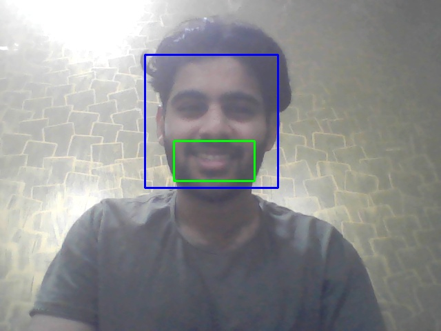

# AutoCapture Selfie using Python

This Python project allows you to automatically capture selfies using a webcam or mobile camera connected via **DroidCam**. It's a simple, fun way to test OpenCV and Python capabilities for image capturing.



## Features

- Automatically captures selfies
- Supports webcam and mobile cameras via DroidCam
- Simple code setup with customizable selfie conditions

## Installation

### 1. Clone the repository

Run the following command to clone the repository to your local machine:

```bash
git clone https://github.com/yourusername/autocapture-selfie-python.git
cd autocapture-selfie-python
